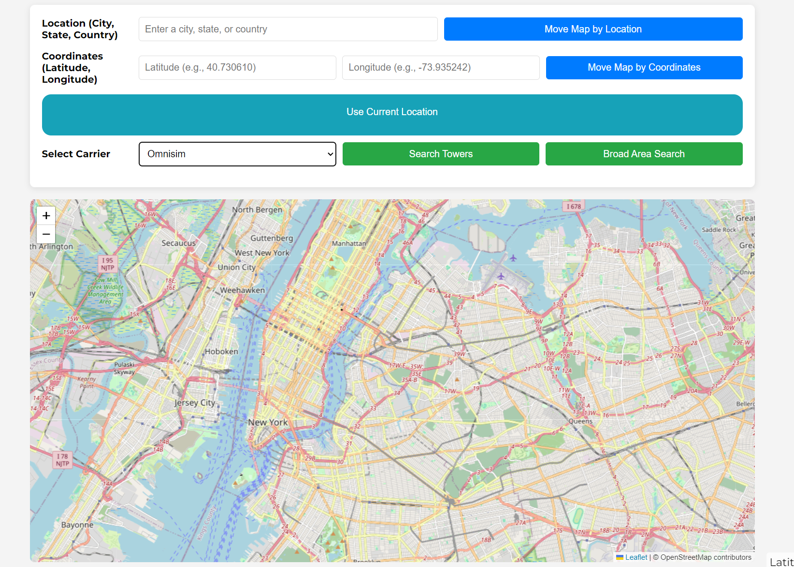
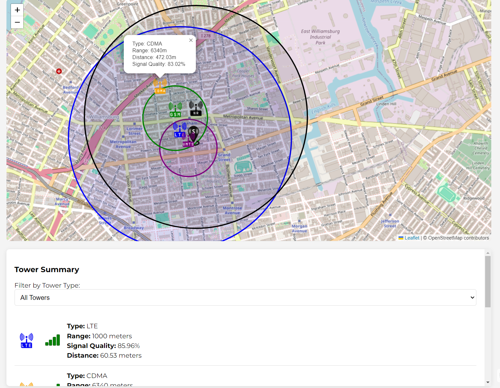

# Cell Tower Finder

[Cell Tower Finder](https://achuanpeng.pythonanywhere.com/) is a web application designed to help users locate and gather detailed information about nearby cell towers based on their current location or a specified address.

## Background and Overview

In today's connected world, understanding the distribution and quality of cellular networks is essential for both users and service providers. **Cell Tower Finder** empowers users by offering comprehensive insights into the cellular infrastructure surrounding them. By leveraging geolocation services and robust data processing techniques, the application delivers accurate and relevant information about cell towers, including their types, ranges, signal quality, and more.

**Key Objectives:**

- **Locate Nearby Cell Towers:** Identify and display cell towers in proximity to the user's location.
- **Filter by Carrier:** Allow users to filter towers based on their preferred cellular carriers.
- **Signal Quality Assessment:** Provide an estimate of signal quality based on distance and tower range.
- **Interactive Map Interface:** Offer a user-friendly and interactive map to visualize tower locations.

## Screenshot & Demo Video

### Demo Video

<video src="github/media/showcase.mp4" autoplay loop muted width="700"></video>

### Filtering by Carrier



### Signal Quality Details




## Functionality and MVP

- **Geolocation-Based Search:** Users can input a location name or use their current geolocation to find nearby cell towers.
- **Carrier Filtering:** Select specific carriers from a dropdown to view relevant towers.
- **Detailed Tower Information:** Access comprehensive details such as type, range, distance, and signal quality for each tower.
- **Interactive Map:** Visualize tower locations on an interactive map with customizable markers and range circles.
- **Loading Indicators:** Real-time feedback during data fetching and processing to enhance user experience.
- **Responsive Design:** Optimized for various devices and screen sizes to ensure accessibility and usability.

## Technologies and Technical Challenges

### Frontend: HTML, CSS, JavaScript, Leaflet.js

- **HTML5 & CSS3:** Building the structure and styling of the web interface.
- **JavaScript (Vanilla JS):** Handling user interactions, map rendering, and asynchronous requests.
- **Leaflet.js:** Implementing interactive maps to display cell tower locations with markers and range circles.

### Backend: Python, Flask, Pandas, NumPy, Geopy

- **Python 3.x:** Core programming language for backend logic.
- **Flask:** Lightweight web framework to handle routing, API endpoints, and server-side operations.
- **Pandas & NumPy:** Efficient data manipulation and numerical computations for processing cell tower datasets.
- **Geopy:** Geocoding and reverse geocoding services to convert addresses to coordinates and vice versa.
- **Pycountry:** Handling country codes for data localization.

### Utilities and Enhancements

- **Cachetools:** Implementing caching mechanisms to store and retrieve frequently accessed data, reducing redundant computations and API calls.
- **Flask-Limiter:** Adding rate limiting to API endpoints to prevent abuse and ensure fair usage.
- **Marshmallow:** Validating and deserializing input data to maintain data integrity and security.

### Technical Challenges

1. **Efficient Data Handling:**
   - **Challenge:** Managing large datasets of cell tower information without compromising performance.
   - **Solution:** Utilized `pandas` with optimized data types (`float32`, `category`) and implemented caching mechanisms using `cachetools` to minimize redundant data loading.

2. **Geocoding Accuracy and Reliability:**
   - **Challenge:** Ensuring accurate and reliable geocoding and reverse geocoding, especially with ambiguous location inputs.
   - **Solution:** Leveraged the `geopy` library with the `Nominatim` service, implemented retry mechanisms for transient errors, and integrated caching to reduce API calls.

3. **Signal Quality Calculation:**
   - **Challenge:** Developing an accurate method to estimate signal quality based on distance and tower range.
   - **Solution:** Implemented a mathematical model using the formula `Q = e^(-k * (d/R))`, ensuring unit consistency and handling edge cases like zero range.
     - **Q** = relative signal quality
     - **e** (euler's number) = 2.71828
     - **k** = decay constant
     - **d** = distance
     - **R** = max range

4. **Optimizing Map Performance:**
   - **Challenge:** Displaying a large number of interactive markers on the map without degrading user experience.
   - **Solution:** Utilized vectorized operations with `numpy` for distance calculations and planned integration with `Leaflet.markercluster` to manage marker density effectively.

5. **Scalability and Maintainability:**
   - **Challenge:** Structuring the application to accommodate future growth and feature additions.
   - **Solution:** Adopted the Flask Factory Pattern for scalable application architecture, modularized code using Blueprints, and maintained a clear separation of concerns across different modules.

6. **User Experience Enhancements:**
   - **Challenge:** Providing real-time feedback and ensuring a responsive interface during data-intensive operations.
   - **Solution:** Implemented loading indicators, optimized frontend performance with efficient JavaScript code, and ensured responsive design for various devices.

## Bonus Features
- [ ] No Cell Towers Found Event Case Handling
- [ ] Cell Tower Association Between List and Interactive Map
- [ ] Advanced Filtering Options
- [x] Mobile Responsiveness Improvements

## Installation

### Prerequisites

- **Python 3.7+**
- **pip** (Python package manager)
- **Git** (for cloning the repository)

### Steps

1. **Clone the Repository**
   ```bash
   git clone https://github.com/yourusername/cell-tower-finder.git
   cd cell-tower-finder
